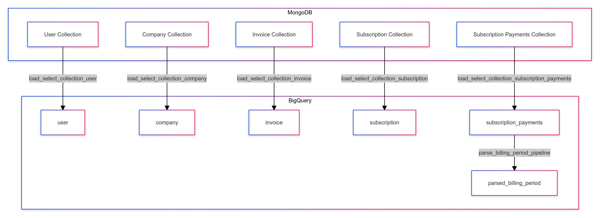

# MongoDB to BigQuery Pipeline
## Setup

### Prerequisites

- Python 3.12
- [Poetry](https://python-poetry.org/docs/#installation)  
- [Docker](https://www.docker.com/products/docker-desktop/)
- [gcloud CLI](https://cloud.google.com/sdk/gcloud)
- `credentials.json` file in the root directory for Google Cloud credentials
- `.env` file in the root directory for environment variables
- `secret.toml` file in the `pipelines/.dlt` directory for pipeline secrets

### Getting Started

1. Clone the repository

```bash
git clone https://github.com/godalida/bookeepee.git
cd mongodb-pipelines
```

2. Ensure the presence of `credentials.json`, `.env`, and `secret.toml` files in their respective directories.

Sample `secret.toml`
```bash
[sources.mongodb]
connection_url = "" # please set me up!
database = "" # please set me up!

[destination.bigquery]
location = "US"
[destination.bigquery.credentials]
project_id = "" # please set me up!
private_key = "" # please set me up!
```
3. Install the dependencies

```bash
poetry install
```

4. Activate the poetry shell

```bash
poetry shell
```

5. Running the pipeline

```bash
cd pipelines
python mongodb_pipeline.py
```

### Weekly Churn Data
1. Weekly churn data can will be generated by the query below.
```sql
SELECT
    COUNTIF(status = 'active' AND start_date >= TIMESTAMP_SUB(CURRENT_TIMESTAMP(), INTERVAL 7 DAY)) AS new_subscriptions,
    COUNTIF(status = 'cancelled' AND end_date IS NULL AND next_billing_date IS NULL AND end_date >= TIMESTAMP_SUB(CURRENT_TIMESTAMP(), INTERVAL 7 DAY)) AS cancelled_subscriptions,
    COUNTIF(status = 'terminated' AND end_date >= TIMESTAMP_SUB(CURRENT_TIMESTAMP(), INTERVAL 7 DAY)) AS terminated_subscriptions
FROM
    `<project_id>.<dataset>.<table_name>`
WHERE
    start_date >= TIMESTAMP_SUB(CURRENT_TIMESTAMP(), INTERVAL 7 DAY)
    OR (status = 'cancelled' AND end_date IS NOT NULL AND end_date >= TIMESTAMP_SUB(CURRENT_TIMESTAMP(), INTERVAL 7 DAY))
    OR (status = 'terminated' AND end_date IS NOT NULL AND end_date >= TIMESTAMP_SUB(CURRENT_TIMESTAMP(), INTERVAL 7 DAY));
```
2. Schedule the Query above on Bigquery and enable Data transfers.

### Pipeline Diagram
